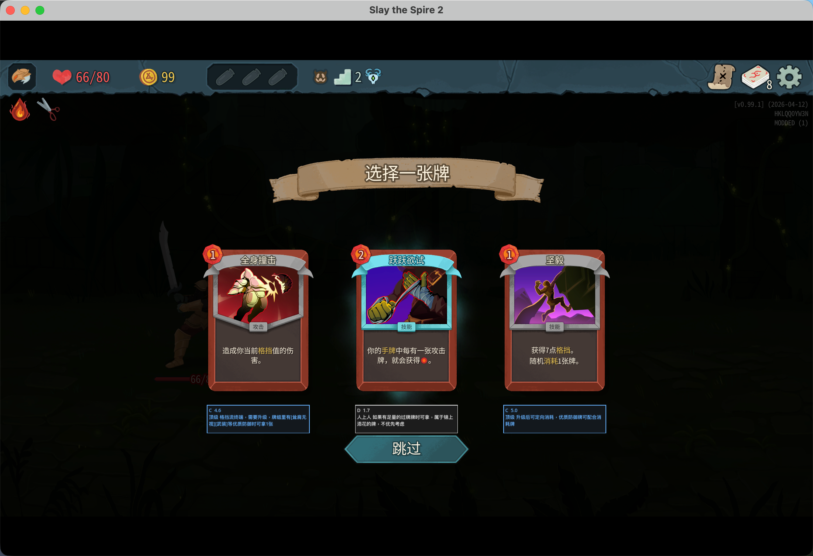

# DeckAdvisor

《杀戮尖塔 2》Mod，在选牌界面（战斗奖励、商店、问号事件）为候选牌显示选牌建议。

## 效果预览



## 前置要求

- [.NET 9 SDK](https://dotnet.microsoft.com/download)
- [Godot 4.5.1 Mono](https://godotengine.org/download) — 用于导出 `.pck` 文件
- 通过 Steam 安装的《杀戮尖塔 2》

## 配置

复制模板文件并填入 Godot 路径：

```bash
cp Directory.Build.props.example Directory.Build.props
```

```xml
<GodotPath>/Applications/Godot_mono.app/Contents/MacOS/Godot</GodotPath>
```

游戏路径会从默认 Steam 库自动检测。如果安装在自定义位置，还需设置：

```xml
<Sts2Path>/path/to/steamapps/common/Slay the Spire 2</Sts2Path>
```

## 构建与部署

**macOS / Linux：**

```bash
./build.sh
```

**Windows：**

```bat
build.bat
```

脚本会自动编译 `.dll`、用 Godot 导出 `.pck`，并将所有文件复制到游戏的 `mods/DeckAdvisor/` 目录。

## card_overrides.json 配置说明

部署后，`mods/DeckAdvisor/card_overrides.json` 文件可以自定义每张牌的显示内容，**修改后重启游戏生效**。

### 全局配置（`_config`）

```json
"_config": {
  "showScore": false,
  "showNote": true
}
```

| 字段 | 类型 | 说明 |
|------|------|------|
| `showScore` | bool | 是否显示算法评分（等级+分数），默认 false |
| `showNote` | bool | 是否显示选牌建议备注，默认 true |

### 卡牌配置

```json
"Offering": {
  "zh": "祭品",
  "scoreOverride": null,
  "note": "无脑拿，优先升级，拿1张"
}
```

| 字段 | 类型 | 说明 |
|------|------|------|
| `zh` | string | 卡牌中文名（只读参考，不影响功能） |
| `scoreOverride` | number \| null | 覆盖算法基础分。`null` 使用算法计算，填数字则强制使用该分数 |
| `note` | string | 选牌建议，显示在卡牌下方信息框。空字符串则不显示信息框 |

### 备注颜色

信息框颜色根据算法评级自动变化：

| 评级 | 颜色 |
|------|------|
| S | 橙色 |
| A | 紫色 |
| B / C | 蓝色 |
| D / F | 白色 |

## 支持的选牌场景

- 战斗后奖励选牌
- 商店购买
- 问号事件选牌

## 文档

- `docs/strategy-ironclad.md` — 铁甲战士选牌攻略汇总
- `docs/cards-mechanics.md` — 所有卡牌效果速查表（基于反编译代码）
